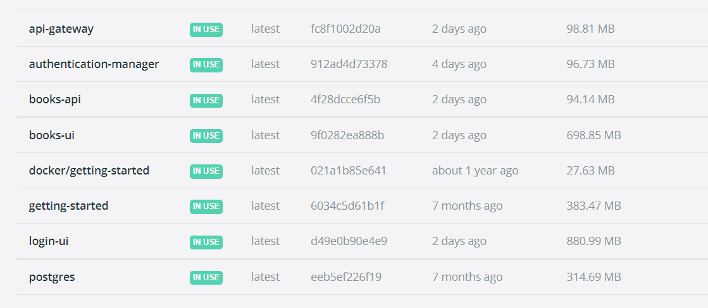
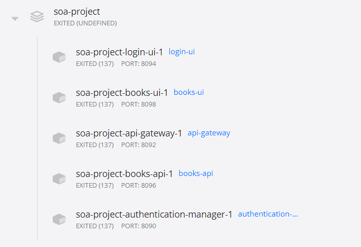

## SOA project

### Application considerations
The purpose of this application is for a user to create a wishlist of books. He can login and see the list of books, but also send an email with the wishlist. The application is composed of microservices.\
For the backend, there is a microservice for the management of the authentication, a microservice that acts as a gateway and redirects the call from the client to the corresponding microservice and a microservice for handling the books requests. \
On the frontend, there are two microservices, one that handles the login part and one that handles the books component.

To start the application, you have to:

- run **docker build <image_name> -t .** in each folder (you have to check the image name in the **docker-compose.yaml** file)
- run **docker-compose up** to start the application
- run **docker-compose down -v** to delete all the images and containers
****

### Integrations
The application uses a third-party service for sending emails called **emailjs**.The user can provide an email address and a name, and after pressing the Send button, the books wishlist will be sent to the specific email address.
****

### Microservices
The application uses Docker for creating the images and deploying the containers.

****

### Design Patterns

**API Gateway Pattern** \
The API gateway locate between the client apps and the internal microservices. It is working as a reverse proxy and routing requests from clients to backend services. It is also provide cross-cutting concerns like authentication, SSL termination, and cache.

**Sidecar Pattern** \
Deploy components of an application into a separate process or container to provide isolation and encapsulation. This pattern can also enable applications to be composed of heterogeneous components and technologies.

**Decompose by business capability Pattern** \
A business capability is a concept from business architecture modeling. It is something that a business does in order to generate value. Each microservice serves a different business capability. The business objects are the user data and the books.
****

****

### Diagrams

_UML diagram_

_c4 context diagram_

_c4 container diagram_

