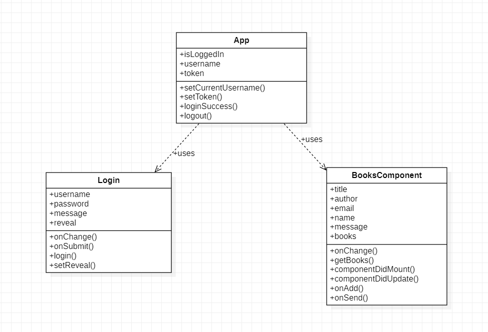
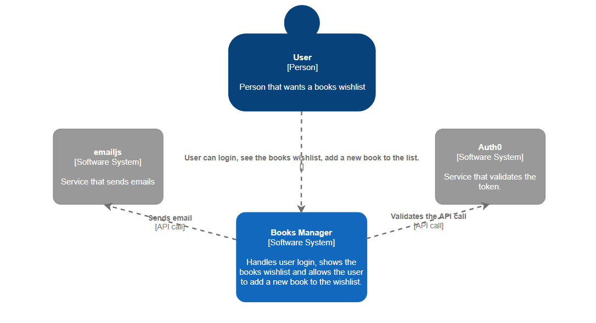
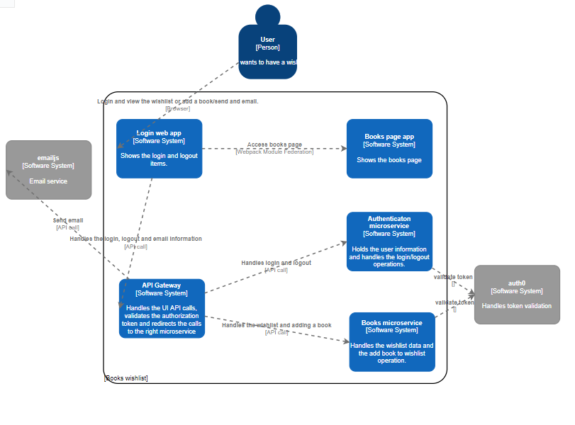

## SOA project

### Design Patterns

**API Gateway** \
The API gateway locate between the client apps and the internal microservices. It is working as a reverse proxy and routing requests from clients to backend services. It is also provide cross-cutting concerns like authentication, SSL termination, and cache.

****

****

### Diagrams

_UML diagram_

_c4 context diagram_

_c4 container diagram_

